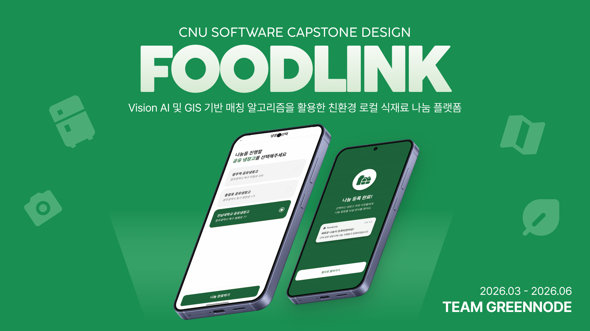
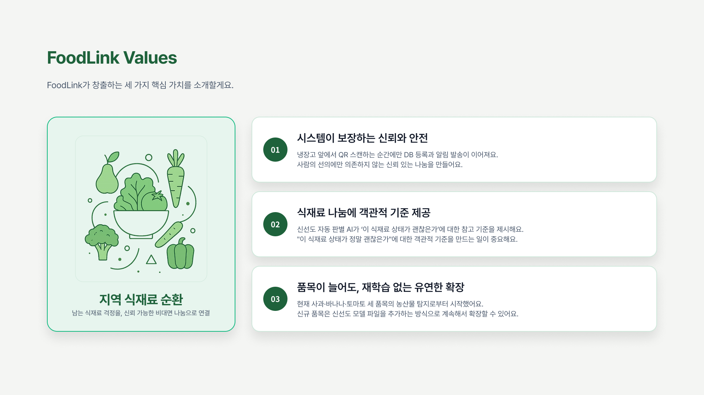

# FoodLink



> Vision AI 및 GIS 기반 매칭 알고리즘을 활용한 친환경 로컬 식재료 나눔 플랫폼

FoodLink는 집에 남은 식재료를 오늘 필요한 이웃에게 연결하는 비대면 식재료 나눔 서비스입니다. 사용자는 사진 한 장으로 식재료 상태를 확인하고, 가까운 공유 냉장고를 거점으로 보관과 수령을 완료할 수 있습니다.

## Team GreenNode


| 역할 | 이름 |
| --- | --- |
| Back-End & Infra | 김구진 |
| Front-End & Design | 최재원 |
| PM & AI Engineer | 제혜정 |

## Background

1인 가구는 계속 늘고 있고, 가정과 소형 음식점에서 발생하는 음식물 쓰레기 비중도 큽니다. 혼자 살거나 소규모로 생활하는 사람은 식재료를 계획대로 모두 쓰지 못하는 일이 자주 생깁니다.

문제는 남은 식재료가 생겼을 때 선택지가 많지 않다는 점입니다. 그냥 버리기는 아깝고, 냉장고에 넣어두면 잊히기 쉽고, 누군가에게 나누려면 글쓰기와 연락, 약속 조율이 필요합니다.

FoodLink는 초과 구매를 예방하는 앱이 아닙니다. 이미 생긴 여분 식재료를 버리기 전, 동네 안에서 처리할 수 있는 마지막 선택지를 만드는 서비스입니다.

## Problem

### 기존 플랫폼은 식재료 나눔에 맞춰져 있지 않음

당근마켓 같은 하이퍼로컬 플랫폼에는 무료나눔 수요가 있지만, 식재료 나눔에 특화되어 있지는 않습니다. 식품 거래와 공유에는 제한이 많고, 사용자는 매번 게시글을 쓰고 댓글을 확인해야 합니다.

### 대면 나눔의 마찰 비용이 큼

나눔을 하려는 사람은 직접 사진을 찍고 글을 작성해야 합니다. 수령자와 시간과 장소를 맞춰 직접 만나야 하며, 노쇼나 지연이 생기면 식재료 가치보다 조율 비용이 더 커집니다.

### 보관과 수령을 믿기 어려움

비대면으로 나누려면 식재료가 실제로 어디에 보관됐는지, 누가 언제 수령했는지 확인할 장치가 필요합니다. 일반 게시글 기반 나눔은 이 과정을 충분히 보장하지 못합니다.

## Solution

FoodLink는 세 가지 장치로 식재료 나눔의 마찰을 줄입니다.

| Pain Point | Solution |
| --- | --- |
| 나눔 과정이 번거로움 | 사진 한 장으로 AI가 식재료 종류와 나눔 가능 상태를 확인 |
| 직접 연락과 대면 부담 | 공유 냉장고를 비대면 전달 거점으로 사용 |
| 보관/수령 신뢰 부족 | 냉장고 QR로 실제 보관과 수령 흐름을 인증 |

FoodLink의 목표는 **비대면으로, 가까운 공유 냉장고에서, 안전한 나눔을 실현하는 것**입니다.

## Design System


## Service Flow

### 공급자

```text
남는 식재료 발견
  -> 사진 촬영
  -> AI 상태 확인
  -> 공유 냉장고 선택
  -> 냉장고 QR 보관 인증
  -> 근처 사용자에게 알림
```

공급자는 길게 설명글을 쓰지 않아도 됩니다. 앱이 사진 기반으로 식재료와 상태를 확인하고, 공급자는 실제 보관할 공유 냉장고만 선택합니다.

### 수요자

```text
홈/지도에서 근처 나눔 식재료 발견
  -> 상세 정보 확인
  -> 나눔 신청
  -> 30분 임시 선점
  -> 공유 냉장고 방문
  -> 냉장고 QR 수령 인증
```

수요자는 모르는 사람과 직접 약속하지 않아도 됩니다. 신청 후 제한 시간 안에 공유 냉장고에서 식재료를 찾아 수령합니다.

### 냉장고 운영자

```text
운영자 콘솔 진입
  -> 냉장고 재고 요약 확인
  -> 바구니 후보와 개별 식재료 점검
  -> 만료/폐기 대상 처리
```

운영자는 시스템 관리자라기보다 공유 냉장고 현장 점검자입니다. 앱 기록과 실제 냉장고 안의 식재료가 맞는지 확인하고, 필요한 항목을 정리합니다.

## Core Features


### AI 신선도 스캔

사진 한 장에서 식재료 품목과 상태를 확인합니다. AI 결과는 식품 안전 보증이 아니라 사용자가 상태를 판단할 수 있도록 돕는 참고 기준입니다.

현재 흐름은 품목 탐지와 신선도 분류를 분리합니다. 사용자는 분석 결과를 확인한 뒤 공유 냉장고를 선택해 나눔을 진행합니다.

### 위치 기반 공유 냉장고 매칭

지도에서 가까운 공유 냉장고를 확인하고, 냉장고 안에 있는 나눔 식재료를 볼 수 있습니다. 홈은 냉장고 목록보다 오늘 가져갈 수 있는 나눔 식재료를 먼저 보여줍니다.

거리 기반 탐색은 사용자가 실제로 이동 가능한 범위에서만 나눔을 발견하게 합니다.

### QR 보관/수령 인증

공급자가 냉장고 앞에서 QR을 스캔해야 나눔이 공개됩니다. 수요자도 신청 후 QR 수령 인증을 완료해야 나눔이 끝납니다.

QR은 냉장고 식별자입니다. 서버는 사용자, 냉장고, 진행 중인 행동, 제한 시간을 함께 확인해 보관과 수령을 처리합니다.

### 거리 기반 알림

공유 냉장고에 나눔이 등록되면 위치 조건에 맞는 사용자에게 알림을 보냅니다. 신청이 접수되면 공급자에게도 알림을 전달합니다.

알림은 사용자가 앱을 계속 보고 있지 않아도 근처 나눔을 놓치지 않게 하는 보조 장치입니다.

### 운영자 콘솔

냉장고 운영자는 현재 재고, 신청 접수 상태, 폐기 후보, 개별 식재료 상태를 확인합니다.

운영자 콘솔은 서비스 신뢰를 위해 필요한 현장 관리 기능입니다. 공유 냉장고가 실제 전달 거점으로 유지되도록 돕습니다.

## FoodLink Values


### 지역 식재료 순환

남은 식재료를 걱정거리로 두지 않고, 가까운 동네 안에서 필요한 사람에게 연결합니다.

### 시스템이 보장하는 신뢰

신뢰도를 최우선 가치로 생각하며, 사람의 선의에만 기대지 않습니다. AI 확인, 위치 기반 매칭, QR 인증, 알림 기록으로 보관과 수령 흐름을 확인합니다.

### 객관적 기준 제공

식재료 상태를 사용자가 직접 설명하지 않아도 됩니다. AI가 품목과 상태에 대한 참고 기준을 제공하고, 사용자는 이를 바탕으로 나눔 여부를 판단합니다.

## Tech Stack

| 영역 | 기술 |
| --- | --- |
| App | React Native, TypeScript |
| Backend | FastAPI, PostgreSQL/PostGIS, Nginx, Docker Compose |
| AI | YOLOv8s, ResNet50, OpenCV |
| Map / Location | Google Maps, GIS distance matching |
| Notification | Firebase Cloud Messaging |

## Running

```sh
npm install
npm start
npm run android
```

iOS 실행 시에는 CocoaPods 의존성을 설치합니다.

```sh
bundle install
pushd ios
bundle exec pod install
popd
npm run ios
```

실제 API는 NHN Cloud VM에 SSH 터널을 열어 접근합니다.

```sh
ssh -L 8080:localhost:80 NHN-Cloud-Server
```
